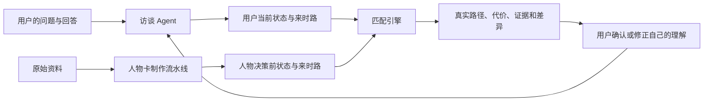

# EchoPath 基础技术设计：访谈匹配 Agent、人物卡制作与多人协作

版本：v0.1；日期：2026-10-02；状态：用户已确认的实施设计，代码尚未实施。

本计划以 `wenyu2026/landscape-demo` 的 `727a997` 为已核对基线。先阅读 `.agent/开发者交接.md`，遵守其中八条设计约束。具体两人分工和接口细节见 [任务包](02-two-person-work-packages.md)。

## 1. 第一版做到什么程度

两套系统相互连接：

- **在线访谈匹配系统**：接收问题，帮助用户说清经历、目标、顾虑和现实限制，再匹配人物在相似阶段的经历。
- **离线人物卡制作系统**：从原始资料提取事实，整理人物在不同时间点的状态，产出在线系统能够直接读取的数据。

采用有明确步骤和状态的 Agent，沿用 Node.js、TypeScript 和现有模型网关。当前数据量直接在内存中比较，不新增向量数据库，不让多个运行时 Agent 互相讨论。

“拟合”定义为比较用户现在的处境与人物某个决策发生之前的处境；第一版不模拟用户未来的人生。

| 项目 | 第一版范围 |
|---|---|
| 场景 | 转专业、考研就业、大厂小厂，三个一起验证 |
| 人物材料 | 现有正式案例为主，S1 人物作为独立对照 |
| 人物卡 | 先做通一张，再扩至六张；三个场景各至少有两个可参考候选 |
| 访谈 | 通常 6–8 轮，最多 8 轮，允许提前查看初步结果 |
| 结果 | 有依据的 2–4 条路径；不足时如实少展示 |
| 调优 | 提示词、字段定义、规则和权重，不训练模型权重 |
| 页面 | 复用现有页面，只增加必要确认、恢复和提示 |

六张卡验证两套系统能否接通，不代表广泛的人生匹配能力；现有正式案例库继续保留。

## 2. 在线访谈与匹配 Agent

### 2.1 帮助澄清，不替用户断言心理

每轮：读取回答 → 提取信息 → 检查矛盾和缺失 → 初步检索 → 决定是否追问 → 更新状态。

例如用户说“我想转专业，但已经读了两年，家里希望我早点工作”，可以提出待确认理解：“你更担心延迟就业，还是换过去以后仍不适合？”不能直接将“害怕失败”“缺乏自主性”写成事实。

用户信息分为明确自述、待确认推断、未知。明确自述绑定回答引用；待确认推断允许修正且不作为高可信匹配事实；没有信息或不愿回答均为未知。

### 2.2 共用十个核心维度

| 字段 | 含义 |
|---|---|
| life_stage | 学习、初入职场、转换等阶段 |
| prior_path | 过去关键选择、经历和尝试 |
| path_investment | 原路径上的时间、训练和资源投入 |
| economic_pressure | 收入需求与过渡期承受条件 |
| family_responsibility | 明确的照顾、供养等责任 |
| resource_access | 资金、技能、资格、支持与机会 |
| goal_structure | 稳定、兴趣、收入、自主等目标 |
| new_path_validation | 是否体验新方向、获得何种反馈 |
| reversibility | 能否返回或调整 |
| time_window | 申请、毕业、合同等期限 |

每项保存值、来源引用、信息性质、支持程度与适用时间。用户引用回答，人物引用资料；未知为 null，不自动填“中等”。适合分档的字段使用有文字锚点的低/中/高，经历和目标使用标签与原文，不把所有维度压成数字。

制度和时代环境用 institutional_context 单独保存，主要用于反类比。

### 2.3 动态追问与停止

追问优先级结合：信息是否缺失/冲突、对匹配的重要性、候选案例在该维度上的差异。程序选择字段，模型自然表达问题；没有候选时按当前问题、来时路、现实限制、目标、新路径验证的顺序补充。

同一字段最多换角度追问一次；明确跳过后不再追问。允许提前结束；预算用尽或用户继续时，提供信息有限的初步结果。最终匹配前总结并请用户确认，纠正后重新匹配，保留修正记录。

### 2.4 小数据量匹配

1. 全量读取决策前检索视图。
2. 比较来时路、目标、约束与其他已知维度。
3. 按人物聚合，每人保留最相关节点，再选择具体事件。
4. 沿用现有机制分组与根因素集合聚类。
5. 展示真实路径、对应案例、与用户相关的代价和差异。

禁止把完整生平拼接后用于早期决策匹配；未来成就只能进入结果层。

初始权重：prior_path、economic_pressure、family_responsibility、goal_structure、new_path_validation 为 2，其余为 1。只比较双方有依据的字段，未知单独计入覆盖情况。人物侧推断降权，回顾性解释不进入决策前匹配。同时保存匹配分和覆盖率；不足三个可比较维度时，只给初步参考并说明信息缺口。权重是待验证初值，每轮调参保留前后结果。

### 2.5 工程边界与恢复

保留现有访谈、地形和案例 API。内部阶段为访谈中、等待确认、检索中、已完成、可恢复错误。固定能力包括状态提取、信息/引用校验、节点检索、路径整理和有引用解释。

模型不修改数据文件，在线访谈不临时上网补人物。解释仅引用当前检索返回证据，引用不存在或缺乏依据时退回结构化模板。

sessionStorage 保存访谈与已确认状态；失败保留输入并允许重试，避免重复作答。重置取消或忽略旧请求。断网提供明确标注的经典离线演示入口，不将快照伪装为实时个性化结果。

## 3. 离线人物卡制作流水线

### 3.1 对象层次

人物 → 事实时间线 → 决策前状态 → 实际选择 → 后续结果。人物卡不能只是固定人格标签。

| 对象 | 最少内容 |
|---|---|
| 来源 | ID、题名、作者/机构、版本、链接或本地资料、具体定位 |
| 原子事实 | ID、人物、发生时间区间、单条事实、出处与争议 |
| 状态快照 | 决策、时间边界、十维状态、事实引用和未知 |
| 决策事件 | 原事件 ID、当时条件、选择、行为、结果与反思 |
| 机制 | archetype、root_factors、支持材料、推断说明 |
| 人物卡 | 对象引用、基本身份、审核状态与版本 |
| 检索视图 | 该节点之前的来路、维度、根因素、制度差异、证据覆盖 |

### 3.2 生产步骤

来源登记 → 定位原文 → 原子事实 → 时间线 → 事件采样 → 决策前状态 → 决策与结果 → 机制标注 → 校验/人工复核 → 导出。

每步保存输入、输出、提示词版本与待确认项，中断后从最近成功步骤继续；ID 稳定，重复运行不随意重编号。

### 3.3 采样

人物按场景、资料完整性、不同走法和有依据的代价选择，不按名气或成功程度选择。首批六张正式案例人物卡覆盖三场景，S1 的 1–2 张独立对照不默认进入正式排名。

节点采用事件驱动：路径进入/退出/转换，投入、经济、责任或资源变化，新方向验证，外部冲击，明确期限。没有变化的年份不机械补快照。

每卡目标为 15–25 事实、4–6 快照、2–3 事件；材料不足标 partial，不凑数。后续结果可成为下一决策的前置事实，不得回填之前的状态。

### 3.4 时间与证据验证

本地 S1 初始实验是 30 人/223 事实/61 决策节点的研究种子，不是已验收正式库。旧构建脚本直接写 temporal_boundary_checked=True，没有实际时间验证。来源可能只定位到整本书或搜索页面，必须补足。

新版检查事实是否确定早于决策；不确定的时间不默认通过。后来的奖项、成败、声望不能进入过去特征。心理动机必须区分直接证据、推断与未知。引用必须定位到具体原文。

区分事实发生时间与资料形成时间：后世传记可以证明早年客观事实，但不能自动证明当时内心和已知信息。多来源可能同源，不冒充独立交叉验证。

机器校验与人工审核分别记录。缺人工签字保留 pending；AI 不自动宣称人类审核完成。

## 4. 两套系统的连接与协作

冻结 UserState v0.1、PersonCard v0.1、RetrievalView v0.1 三个结构。由 A 统一协调含义、取值、未知、ID、时间边界和错误格式；B 提建议但不私改公共接口。

复用正式 DecisionEpisode ID，通过引用关联。结果字段的 null 兼容与备注清理仍是 A 协调的公共变更，B 不改原数据契约绕过它。

先建立独立试验数据源：使用新视图时不得悄悄混合旧评分。原流程保留，验收后再扩大。没有新人物卡的旧案例不强行迁移。

本轮两人：A 负责在线访谈、匹配、必要前端适配与集成；B 负责离线人物卡、校验和导出。按既有责任区协调；共享类型与锁文件仍由仓库原 owner 审查。

先跑通一张样卡及一个请求，再并行扩展。共用样例请求/响应和类型；一个文件一个主要修改人；新增兼容字段与破坏性修改分开处理。独立分支、小 PR，每个可用工作包及时联调。

## 5. 迭代与验收

第一轮：冻结约定，完成一张真实样卡和“回答→状态→检索→路径→证据”闭环。

第二轮：扩六张卡和十八个固定情景，每场景六个；十二个调试、六个保留验收。覆盖正常、资源差异、来路差异、信息不足、用户纠正。每轮只调提示词、字段或权重中的一类，保留版本。

第三轮：验证刷新、错误、超时、离线入口；运行现有测试及新增契约、时间边界和全流程测试。

必须满足：未表达的心理不冒充确认事实；关键人物信息有出处；未来事实注入被拒绝；仅改未来结果不改变过去匹配；预设关键约束变化影响相应分数/解释；不足时少给路径；卡片更新通过共同契约测试；恢复过程不丢已确认回答。

现有命令：npm test、node --test data/validate-data.test.mjs、npm run validate:data、npm run build、npm run lint、npm run demo:verify、npm run smoke、npm run smoke:offline、npm run preflight。启动用 npm start；没有 key 可以跑离线测试，但不能宣称在线模型链路通过。新增测试命令由各负责人实际实现后写入交接，不将未来命令写成现成工具。

## 6. 本地记录与中断恢复

共享设计与契约进入版本管理；每条工作线单独保存交接，A 汇总；流水线保留输入摘要、输出、来源、提示词版本、校验和失败原因。检查点先写临时文件再替换，中断后不将半份输出当完成。

本地 Git 提交无需联网。网络恢复后再同步；密钥、本地专用记忆、未审核原始研究稿不混入提交。LOCAL_AI.md 只留本机，不强制 add。

完成标准：用户说清处境后，在少量可靠人物卡中找到有依据的参考节点，解释相关与差异，允许纠正后重新匹配。
